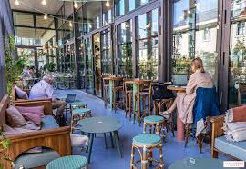
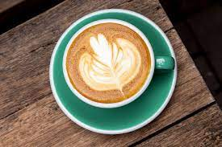

---

# Do you love Coffee?? We do too! Come visit our caffination station!
{:width="300"}
{:width="300"}

#### What makes Café Cocca GREAT?
- We have indoor AND outdoor seating
- We serve everything in hand-made ceramic mugs or plates
- We have delicious drinks and breakfast offerings
- Just check out some reviews from our customers! {:width="50"}

## Reviews:
>*"the latte was by far the best...I think my date here went super well because of how delicious and cute this café was so I give it a 10/10"* -Elizabeth
 
>*"Their scones are to die for!"* -Bobby

## Announcements:
*WE ARE HIRING!*
Café Cocca is currently looking to expand our team!
 
Positions available:
 
- Bread and Pastry Baker
- Part-time Barista
- Cashier
- Dishwasher
 
*Click on the contact tab to find our email, send us your resumé & cover letter, or inquire at our storefront!*

## Location:
13 Love Lane, Portland, OR 99999

## Hours:
>Hours vary on/around holidays - Will be posted on the gram, FOLLOW US! @cafe_cocca
 
- Monday: CLOSED
- Tuesday: 7:00 am - 3:00 pm
- Wednesday: 7:00 am - 3:00 pm
- Thursday: 7:00 am - 9:00pm
- Friday: 7:00 am - 9:00pm
- Saturday: 7:00 am - 9:00pm
- Sunday: 7:00 am - 9:00pm