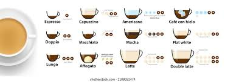
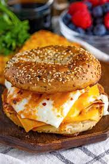

### Drinks:
>All drinks come in one size! In a hand-thrown mug!
>If you want it to-go, bring your own to-go cup!
>Totally customizable!
 

#### All the espresso options! -all $2.00
{:width="400"}
 

#### Matcha Latté -$2.50
{:width="200"}

#### Tea options: -$1.50
- green
- black
- white peach
- peppermint
 

{:width="200"}
 

#### Drink customizations: -no additional charge!
- Milk options: cow, soy, almond, oat
- Flavors: vanilla, chocolate, caramel, lavendar, rose,

 

### Savories:
>All savories come with a side: fruit or a hashbrown
 

#### Breakfast Sandwich -$4.50
- bread options: bagel/bread/english muffin
- cheese options: cheddar, provolone, pepperjack (recommended)
 

{:width="200"}
 

#### Brakfast Burrito -$4.50
- with egg, cheese, peppers & oinions
 

{:width="200"}
 

#### Loaded Foccacia Bread -$3.00
#### Bacon/cheddar Scone -$2.50
 

### Sweets:
#### French Toast -$6.50
- with Berries
 

{:width="200"}
 

#### Muffins: -$3.50
- flavors: chocolate chip, blueberry, cinnamon & sugar
 

#### Donuts: -$2.50
- flavors: plain, cinnamon & sugar, powdered sugar, flavor of the day
 

{:width="200"}